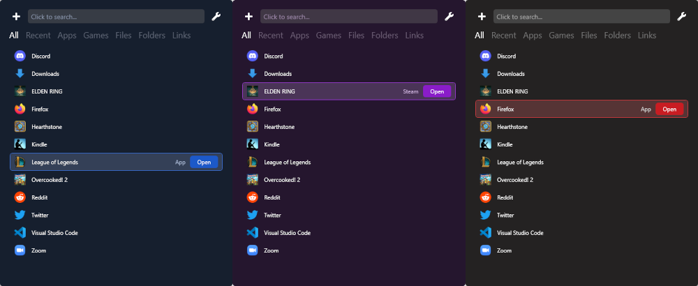

StoreCard
====

StoreCard is a Windows app that acts as an enhanced version of the built-in search bar.

### Tired of the Windows search bringing up things you don't care about?
StoreCard only shows items you've added yourself.

### Tired of it not detecting your games?
StoreCard detects games from:

* Steam
* Epic Games
* Battle.net
* Xbox
* EA/Origin
* Itch.io

### Wish you could find files, folders, and links with ease?
With StoreCard, you can!

## Features

* Add apps, games, files, folders, and links to the search list.
* Use a configurable keyboard shortcut to search anywhere, any time.
* Filter your search by category, or choose an item you've opened recently.
* Customize items you've added to change their names, which app is used to open them, and more.
* Choose from a variety of themes.
